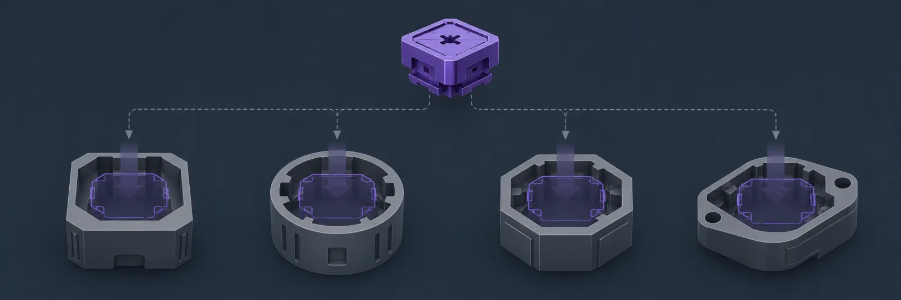
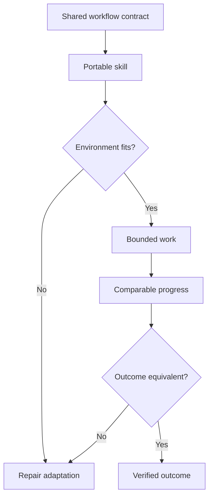

[← All systems](https://github.com/J0UH) · [Agentic systems](https://github.com/J0UH/agentic-systems)

  

# Portable agent capabilities

Agent products change quickly, but the useful work stays familiar: bring in the right context, route the task, control authority, preserve progress, and verify the outcome. Those capabilities should survive a change of tool or model.

## The engineering problem

A useful workflow should not depend on one vendor or interface. The work focused on a stable operating contract, with small adaptations only where an environment truly behaves differently.

## What the system covers

- Portable task and instruction patterns
- Repeatable setup and handoff
- Access and authority boundaries
- Context and progress continuity
- Consistent verification across environments
- Evaluation of new tools without rewriting the workflow

## System shape

## Build notes

- Keep the useful workflow independent from the current tool.
- Treat setup and change as part of product quality.
- Compare outcomes before declaring a workflow portable.

Personal adaptation. Upstream authorship and licences are credited above. Public overview only; source code and private operating details are not included.

## Talk through a similar problem

Working on something similar? [Tell me about it](mailto:ju@jomena.group?subject=Portable%20agent%20capabilities).
