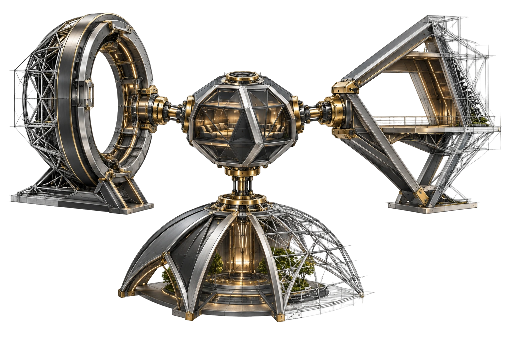
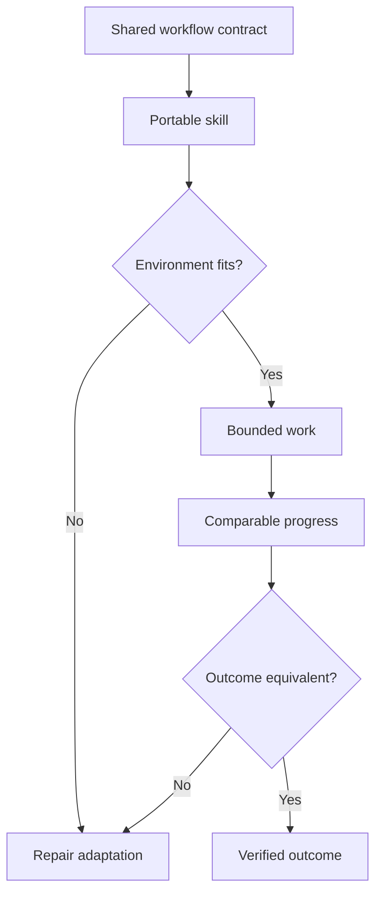

[← All work](https://github.com/J0UH) · [Agentic systems](https://github.com/J0UH/agentic-systems)

# Portable agent capabilities

Personal work on keeping useful agent workflows intact as tools, models, and environments change.

A tool changes, but the work often remains familiar. A task still needs the right context, a way to make progress, permission to act, and a check at the end.

This work looks for the parts of that process that can remain stable. A workflow should be understandable enough to move between environments without rebuilding its logic around every new interface.

## Portability has to include the handoff

Setup is part of the experience. The next environment needs to understand the assignment, the progress already made, and which decisions are still waiting.

I keep a common operating contract and make smaller adaptations where a tool genuinely behaves differently. Context, permissions, and verification need to travel with the task rather than remain implicit in one product.

A familiar-looking prompt is not enough to establish portability. The useful test is whether the workflow still produces the intended result and handles the same interruptions and limits. That is what makes trying a new tool informative rather than starting over.

## What the work covers

- Portable task and instruction patterns
- Repeatable setup and handoff
- Access and authority boundaries
- Context and progress continuity
- Consistent verification across environments
- Evaluation of new tools without rewriting the workflow

A closer look at the technical flow

## Related work

- [Agentic systems](https://github.com/J0UH/agentic-systems)
- [Personal AI employee](https://github.com/J0UH/personal-ai-employee)

Working on a similar problem? [Tell me what you are building](mailto:ju@jomena.group?subject=Portable%20agent%20capabilities).

*This is a public account of the work. Source code and private operating details are not included in this repository.*
