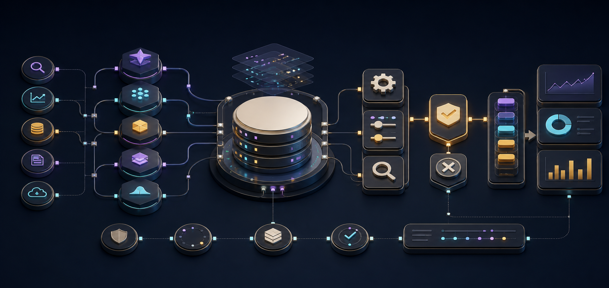
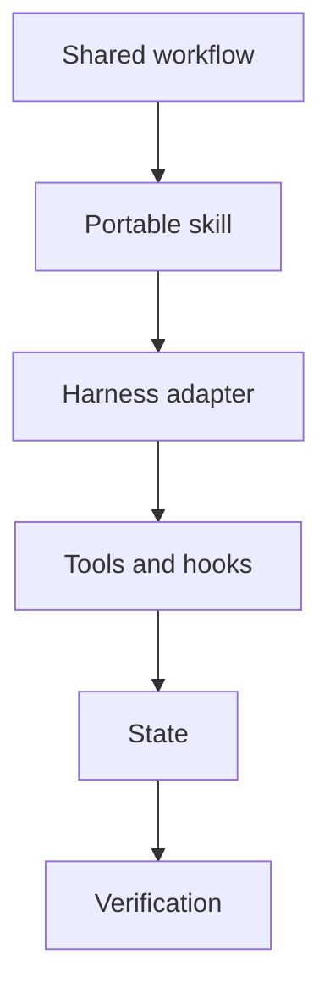

  

# Cross-harness agent tooling

Agent harnesses differ in their tools and interfaces, but the operating problems repeat: install the right context, route work, control authority, preserve state, verify outcomes, and make extensions portable.

[Discuss a similar system](mailto:ju@jomena.group?subject=Discuss%20Cross-harness%20agent%20tooling) | [Book a technical call](mailto:ju@jomena.group?subject=Book%20a%20technical%20call%20about%20Cross-harness%20agent%20tooling)

## The engineering problem

A useful workflow should not depend on one model vendor or one CLI feature. The work focused on the common primitives beneath Pi, Hermes, Globot, Bootstrap, Codex, and other harnesses, then adapted them where platform differences actually mattered.

## What the system covers

- Portable skills and instruction layers
- Hook and lifecycle integration
- Bootstrap and environment setup
- Tool and permission boundaries
- Cross-harness context and state patterns
- Evaluation of new agent runtimes

## System shape

## Build notes

- Keep the workflow contract independent from the harness adapter.
- Treat installation and upgrades as part of product quality.
- Attribute upstream runtimes while owning the integration patterns.

This page covers hands-on adaptation and operating experience. Upstream projects remain credited to their maintainers and licences; private personal context and implementation stay private.

## Talk through a similar problem

If you are trying to build, untangle, or ship a system in this area, [send me a note](mailto:ju@jomena.group?subject=I%20need%20help%20with%20Cross-harness%20agent%20tooling). If the problem needs a deeper technical conversation, [book a call by email](mailto:ju@jomena.group?subject=Book%20a%20technical%20call%20about%20Cross-harness%20agent%20tooling).
